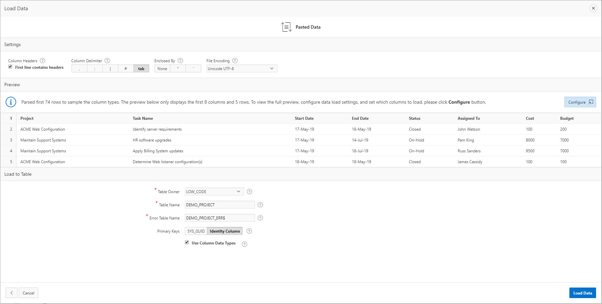
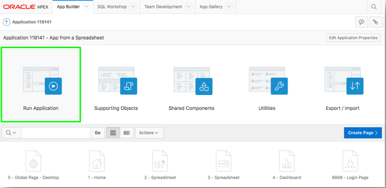

# Module 1: 첫 APEX App 만들기: 엑셀 데이터

'**Module 1**'에서는 엑셀 파일의 데이터를 데이터베이스에 임포트하고 이 데이터를 이용하여 APEX App을 만드는 방법을 소개합니다. 핸드온 랩을 단순하게 구성하기 위해서 APEX의 샘플 데이터를 사용할 것입니다. 그러나 핸즈온 랩의 실습 절차는 실제 데이터를 업로드하는 절차와 동일합니다. 

### **Part 1**: project와 task 데이터 로딩

1.  APEX 워크스페이스 홈페이지에서 **App Builder** 버튼을 클릭합니다. 

2.  '**Create a New App**'을 클릭합니다.

    

3.  '**From a File**'을 클릭합니다.

    

    파일로부터 애플리케이션을 생성할 때, APEX가 지원하는 파일 포맷은 CSV, XLSX, XML, JSON입니다. 이러한 형식의 파일을 업로드하고 이 파일 데이터를 기반으로 애플리케이션을 구축할 수 있습니다. 추가로 CSV 데이터를 복사&붙여넣기 방식을 사용할 수 있고 샘플 데이터를 사용할 수 있습니다. 

4.  '**Load Data wizard**'에서 상단에 위치하는 **Copy and Paste** 옵션을 선택합니다. 그리고 샘플 데이터셋에서 **Project and Tasks**를 선택합니다. 그리고 '**Next**' 버튼을 클릭합니다.

    

5.  파싱된 데이터 결과를 확인합니다. 그리고 테이블 이름으로  **DEMO_PROJECT**를 설정하고 '**Load Data**' 버튼을 클릭합니다. 에러 테이블 이름의 기본값은 테이블 이름에 \_ERR$를 접미사로 결합한 형태입니다. 

    
    
    '**Load Data**'를 클릭하면, 데이터 로딩 작업이 완료될 때까지 스피너가 출력됩니다. 데이터 로딩이 완료되면, **Part 2**를 진행하시기 바랍니다. 

### **Part 2**: 애플리케이션 생성과 실행

Part 1에서 'Data Load wizard'는 새로운 테이블을 한 개 생성하고 샘플 데이터를 새로운 테이블에 적재했습니다. 이제 새로 만든 테이블을 기반으로 APEX App을 생성할 수 있습니다. 

1.  **DEMO_PROJECT** 테이블에 73개 데이터가 적재되었는지 확인합니다. 그리고 **Create Application** 버튼을 클릭합니다.

    

2.  애플리케이션 이름으로 '**App from a Spreadsheet**'을 설정합니다. 그리고 , '**Features**'에 **Check All**를 클릭합니다. 

    
    

    App Wizard가 애플리케이션 생성을 마치면, App Builder에 애플리케이션 홈페이지로 이동합니다. 

### **Part 3**: 새로운 앱 탐색

1. 이제 '**Run Application**'을 클릭하면 브라우저의 새로운 탭에서 애플리케이션이 실행됩니다. 여기에서 애플리케이션이 어떻게 보이는지 확인할 수 있습니다. 

    

2.  사용자 아이디와 패스워드를 입력하고 **Sign In** 버튼을 클릭합니다. 

3.  실행된 애플리케이션을 살펴보겠습니다. 홈 메뉴 혹은 왼편의 내비게이션 메뉴에서 **Project** 아이콘을 클릭하면, 'report' 페이지에 샘플 데이터가 출력됩니다. 샘플 데이터를 출력하는 테이블 첫 번째 컬럼의 '편집 아이콘'을 클릭하면, 수정 가능한 폼 페이지에 상제 정보가 출력됩니다. 이번에는 **Dashboard** 페이지로 이동합니다. 이 페이지에서 여러 차트가 출력되는 것을 확인할 수 있습니다. 마지막으로 **Administration**에서 이용 가능한 여러 옵션을 확인합니다.

    

## 요약

'**Module 1**'이 완료되었습니다. APEX 교육에 사용할 샘플 데이터를 업로드하고, 이 데이터를  이용하여 애플리케이션을 생성하는 방법을 알아보았습니다. [이 링크를 클릭하여 'Module 2'로 넘어가시기 바랍니다.](2-using-the-runtime-environment-improving-the-report-and-form.md)
