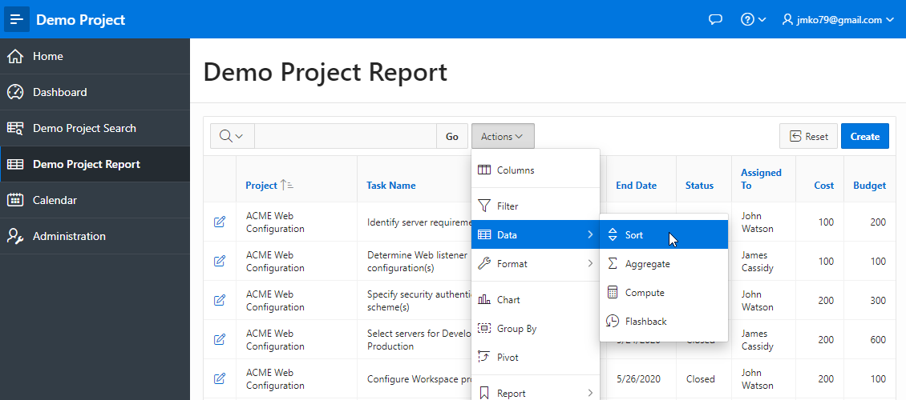
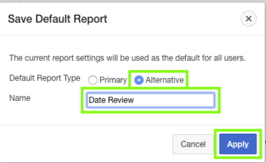

# Module 2: 리포트와 폼 개선

'**Module 2**'에서는 대화형 리포트 사용자 경험과 페이지 홈을 개선하여 애플리케이션을 관리하는 실습을 진행합니다. 

### **Part 1**: 기본 대화형 리포트 개선(1)

이제 애플리케이션 한 개가 생성되었습니다. 더욱  명확한 데이터 시각화를 위하여 리포트 페이지를 개선할 시점입니다. 

1. 만약에 애플리케이션이 실행된 상태가 아니라면, 개발 환경에서  App Builder로 이동하고, '**App from a Spreadsheet**'을 선택하고 '**run application**'을 클릭하여 실행합니다. 그리고 왼편 메뉴에서 '**Project**' 클릭합니다. 

2. 검색 창 옆에 '**Actions**' 버튼을 클릭합니다. 컨텍스트 메뉴에서 '**Data**'을 선택합니다. 그리고 출력되는 서브 메뉴에서 **Sort**를 클릭합니다. 

3. 1번 행에서 '**Start Date**'를 선택합니다. 그리고 2번 행에서 '**End Date**'를 선택합니다. 그리고 '**Apply**'를 클릭합니다. 

    
    

4. 이제 리포트를 저장할 순서입니다. '**Actions**' 선택하고, 메뉴에서 '**Report**'를 선택합니다. 그리고 '**Save Report**'를 클릭합니다.

5. 저장을 위해서 '**As Default Report Settings**'를 선택합니다.

    

6. 'Default Report Type'으로 '**Alternative**'를 지정하고, 이름으로 '**Date Review**'를 설정합니다. 그리고 '**Apply**' 버튼을 클릭합니다.
  

    

### **Part 2** - 기본 대화형 리포트 개선(2)

'**Part 2**'에서는 앞에서 사용한 2개 컬럼을 계산하고 그 결과로  새로운 컬럼을 추가해볼 것입니다. 그리고 리포트를 검토하는 챠트를 만들어 볼 것입니다. 

1. **Actions**을 선택한 다음에 **Data**를 선택하고 다시 **Compute**를 클릭합니다. 

2. 다음 데이터를 입력합니다. 그리고 '**Apply.**' 버튼을  클릭합니다.


    | Property | Value |
    | --- | --- |
    | Label | **Budget V Cost** |
    | Format Mask | **$5234.10** |
    | Computation Expression | **I - H** |

    

    반응형 리포트에 '**Budget V Cost**' 컬럼이 추가됩니다. 

3. 이제 **Chart**를 추가하기 위해서, **Actions**을 선택한 후 이번에는 **Chart**를 클릭합니다.

4. 다음 데이터를 입력합니다 그리고 **Apply** 버튼을 클릭합니다.

    | Property | Value |
    | --- | --- |
    | Label | **Project** |
    | Value | ****Budget V Cost** |
    | Function | **Sum** |
    | Sort | **Label-Ascending** |
    | Orientation | **Horizontal** |

    

    '**Apply**' 버튼을 클릭하면 뷰 챠트 버튼이 활성화됩니다. 그리고 뷰 챠트 버튼과 뷰 리포트 버튼을 이용하여 리포트와 챠트 뷰를 토글할 수 있습니다.  

    
    
5. 이제 **Save report** 차례입니다. 리포트 저장을 위해서 'Module 2' Part 1의 스텝 4에서 스텝 6까지 절차를 반복합니다. 
    
### **Part 3** - 폼 개선

1. 'Runtime Environment'에서 뷰 리포트 아이콘을 클릭합니다. 

    

2. 런타임 환경에서 레코드의 편집 아이콘을 클릭합니다. 

    

3. 모델 페이지가 출력됩니다. 

4. 화면 아래에 위치한 Developer Toolbar의 '**Quick Edit**' 아이콘을 클릭합니다. 

    

5. **Status** 항목 위에 마우스를 올리고(파란색 윤곽선이 나타날 때까지) 마우스를 누르십시오.

6.  **Status** 항목의 'Page Designer'가 출력됩니다. 

7. 'Page Designer'의 오른쪽에 위치하는 'Property Editor'에서 'Type' 항목을 '**Select List**'로 지정합니다.

8. 'List of Values' 그룹에 포함된 'Type'에서는 '**SQL Query**'를 지정합니다.

9. 'Type'을 지정하고 나타나는 'SQL Query' 오른쪽에 표시되는 , '**Code Editor**' 아이콘을 클릭합니다.

    

10. 'Code Editor'에 다른 SQL을 입력합니다. 

    ```
    select distinct status d, status r
    from demo_project
    order by 1        
    ```

11. 'Code Editor'에 출력되는 아이콘 중 마지막에 위치하는 '**Validate**' 아이콘을 클릭합니다. 코드 검증이 성공하면 '**OK**' 버튼을 클릭합니다.

    
  
12. 'Property Editor'에 SQL Query 아래에 위치하는 'Extra Values'에서 '**No**'를 설정합니다.

13. 'Null Display Value'에 '**- Select Status -**'를 설정합니다.

14. 'Page Designer'의 오른쪽에 위치하는 상단에 위치하는 **Save** 버튼을 클릭합니다. 

    

15. 이제 런타임 환경으로 돌아옵니다. 브라우저를 리프레쉬하고 다시 레코드의 'edit icon'을 클릭하고 **Status** 상태의 변경 상태를 확인합니다. 

    

## 요약

이로써 '**Module 2**'가 완료되었습니다. '**Module 1**'에서는 런타임 환경에서 페이지를 업데이트하고 수정하는 방법과 페이지 디자이너를 사용하여 양식을 개선하는 방법을 실습했습니다. [이 링크를 클릭하여 'Module 3'으로 넘어가시기 바랍니다.](3-using-the-runtime-environment-adding-a-calendar.md)


