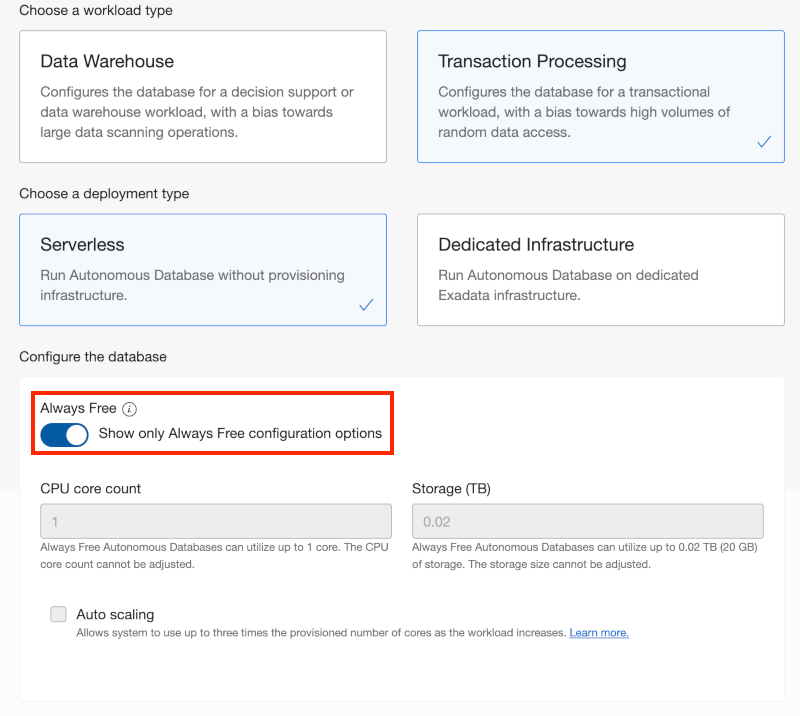
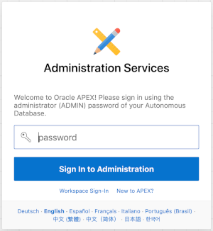

# Oracle APEX 애플리케이션 개발 - 엑셀 파일 데이터

이번 핸즈온 랩에서는 엑셀 파일을 오라클 데이터베이스 테이블로 올린 후, 이 테이블을 기반으로 APEX 애플리케이션을 생성하는 과정을 소개합니다. 결과 __Interactive Report__와 __Form Page__를 사용하는 방법을 학습하게 될 것입니다. 마지막으로 일정 관리 페이지를 만든 후, 이 페이지를 기존 __Form Page__에 연결할 것입니다. 

이 핸즈온 랩을 익히면 짧은 시간(5-6분)에 엑셀 데이터로 새로운 앱을 만들 수 있습니다. 이제는 이메일로 엑셀 파일을 전송하기보다는 엑셀 데이터로 개발된 앱 URL을 메일로 보내는 방법을 사용하게 될 것입니다. 이렇게 개발된 앱은 보안 측면에서 안전하고 확장성을 갖습니다. 또한, 복수 사용자가 이용 가능합니다. 또한, 데이터의 중복과 비-정합성 문제를 해결하는 SSOT(Single Source of Truth)를 제공합니다. 

- SSOT(Single Source of Truth)는 같은 자료가 여러곳에서 존재하는 경우에 발생되는 자료의 중복, 비정합성 등의 문제를 해결하는 정보시스템의 설계 이론입니다. 

## 핸즈온 랩 목표

* 워크스페이스 확보
* 엑셀 파일을 업로드하여 첫 번째 앱 개발
* 대화형 보고서 기능 향상 
* 일정 관리 추가

## 핸즈온 랩 모듈

| # | Module | Est. Time |
| --- | --- | --- |
| 1 | [엑셀 파일을 업로드 및 앱 개발](1-building-your-first-app-creating-an-app-from-a-spreadsheet.md) | 4 min |
| 2 | [리포트와 폼 기능 개선](2-using-the-runtime-environment-improving-the-report-and-form.md) | 10 min |
| 3 | [일정 관리 추가](3-using-the-runtime-environment-adding-a-calendar.md) | 5 min |


## 핸즈온 랩을 위한 사전 작업

### **Part 1**: 오라클 클라우드 트라이얼 계정 확보

'**Part 1**'에서는 오라클 클라우드 트라이얼 계정을 생성하는 과정을 소개합니다. 이미 오라클 클라우드 계정을 확보한 상태라면 '**Part 2**'로 이동하시기 바랍니다. 

1. 본 핸즈온 랩이 진행되는 현장에서, 핸즈온 랩 진행자는 오라클 클라우드 계정 등록을 위한 링크를 제공할 것입니다. 오라클 클라우드 트라이얼 계정 등록 절차를 완료하면 오라클 클라우드 계정이 생성됩니다. 이 계정은 300달러 상당의 크래딧과 몇 개의 "영구 무료(Always Free)" 서비스가 제공됩니다. 이 계정을 사용하면 본 핸즈온 랩을 완료할 수 있습니다. 핸즈온 랩이 끝난 후에, 남은 크레딧을 사용하여 오라클 클라우드를 계속 사용할 수 있습니다.  트라이얼 계정은 사용 기간은 30일입니다. 계정 사용 기간인 30일 후에도 영구 무료 서비스(Always)는 계속 사용 가능합니다. 

2.  오라클 클라우드 트라이얼 계정을 등록하면, 바로 다음과 같은 이메일을 받게 될 것입니다. 다음과 같은 이메일을 받았다면 '**Part 2**'로 이동하시기 바랍니다. 

    

### **Part 2**: 오라클 클라우드 로그인

'**Part 2**'에서는 오라클 클라우드 계정에 로그인하고, 다양한 서비스를 작업을 시작해 볼 것입니다. 

1. 제목이 "**Get Started Now with Oracle Cloud**"인 메일을 받았다면, **사용자명(Uaername)**, **패스워드(Password)**, 그리고 **클라우드 계정명(Cloud Account Name)**을 확인합니다.

2. 브라우저에서 다음 URL로 이동합니다. 
   - https://www.oracle.com/cloud/sign-in.html.

3. 입력 필드에 "**클라우드 계정명(Cloud Account Name)**"을 입력하고 **Next** 버튼을 클릭합니다. 

    

4. 입력 필드에 **사용자명(Uaername)**과 **패스워드(Password)를 입력하고 **Sign In** 버튼을 클릭합니다. 

    

### **Part 3**: Autonomous Transaction Processing 인스턴스 생성

'**Part 3**'에서는 ATP(Autonomous Transaction Processing database service) 인스턴스를 만들어 볼 것입니다. 

1. 클라우드 대시보드에서 왼쪽 상단의 햄버거 아이콘을 선택한 다음에 '**Autonomous Transaction Processing**' 메뉴를 선택합니다. 

    

2. 이동한 페이지에서 "**Create Autonomous Database**" 버튼을 클릭합니다.

    

3. **Always Free** 옵션을 선택한 다음 **ADMIN** 패스워드로 **```SecretPassw0rd```**를 입력합니다. 그리고 '**Create Autonomous Database**' 버튼을 클릭합니다.


    
    
    

    '**Create Autonomous Database**' 버튼을 클릭하면, Automonous Database 상세 페이지로 이동합니다. Automonous Database 상세 페이지의 "**ATP**" 아이콘 배경색이 진한 노란색에서 초록색으로 변경된면 다음 '**Part 4**'를 진행합니다. 

    
    

### **Part 4**: APEX 워크스페이스 생성

APEX를 사용하기 위해서는 워크스페이스가 필요합니다. 워크스페이스(workspace)는 APEX 애플리케이션을 정의하는 논리적인  도메인입니다. 워크스페이스를 생성하려면 APEX 인스턴스 관리자로 로그인해야 합니다. 각 워크스페이스는 하나 이상의 데이터베이스 스키마(데이터베이스 사용자)와 연결됩니다. 데이터베이스 스키마에는  테이블, 뷰, 패키지 등과 같은 데이터베이스 개체가 저장됩니다. 일반적으로 이러한 데이터베이스 객체 위에 APEX 애플리케이션이 구축됩니다. 

1. ATP 상세 페이지에서 '**Service Console**' 버튼을 클릭합니다.

    

2. 왼쪽 메뉴에서 **Development** 옵션을 선택한 후, 화면에 출력되는 '**Oracle APEX**' 패널을 클릭합니다. 

    

3. 'Administration Services'를 위한 패스워드를 입력하고 '**Sign In to Administration**' 버튼을 클릭합니다. 여기에  입력하는 패스워드는 ATP 인스턴스를 생성할 때 ADMIN 사용자 패스워드로 설정했던 **```SecretPassw0rd```** 입니다. 

    

4. '**Create Workspace**' 버튼을 클릭합니다.

    

5. 다음 정보를 입력하고 **Create Workspace** 버튼을 클릭합니다.

    | 속성 | 값 |
    | --- | --- |
    | Database User | DEMO |
    | Password | **```SecretPassw0rd```** |
    | Workspace Name | DEMO |

    

6. 페이지 상단의 성공 메시지에 포함된 **DEMO** 링크를 클릭합니다. **DEMO** 링크를 클릭하면, 새 워크스페이스에 로그인하기 위해서 'APEX administration'에서 로그아웃하게 됩니다.  

    

7. 패스워드 입력 필드에  **``SecretPassw0rd``**를 입력합니다. 그리고 '**Remember workspace and username**' 체크 박스를 체크한 다음에  **Sign In** 버튼을 클릭합니다.

    
    
## 요약

이것으로 핸즈온 랩 사전 설정이 완료되었습니다. 지금까지 새로운 ATP 인스턴스를 생성하고, ATP 인스턴스에 APEX 워크스페이스를 만드는 방법을 확인했습니다. [이 링크를 클릭하여 다음 모듈로 넘어가시기 바랍니다.](1-building-your-first-app-creating-an-app-from-a-spreadsheet.md)