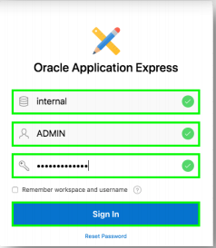

# Module 2: REST 엔드포인트를 기반으로 APEX 애플리케이션 구축- 애플리케이션 생성

'모듈 2'에서는 두 번째 워크스페이스에 로그인합니다. 그리고 애플리케이션을 생성합니다. 

### **Part 1**: 두 번째 워크스페이스 생성 및 로그인

1. 상단 오른쪽에 위치하는 툴바에서, 사용자 이름을 선택하고' **Sign Out**'을 실행한다. 그리고 '**Return to Sign In Page**'을 선택한다.
. 
    

2. 내부 관리자 계정으로 로그인 합니다. 입력 항목에 다음과 같이 입력합니다. 입력을 마치고 '**Sign In**' 버튼을 클릭합니다.

    | Property | Value |
    | --- | --- |
    | Workspace | internal |
    | Username | ADMIN |
    | Password | **`Secretpassw0rd`** |

    

3. '**Create Workspace**'를 클릭합니다. 

    

4. 다음과 같은 항목을 입력합니다. 입력을 마치고 '**Create Workspace**' 버튼을 클릭합니다.

    | Property | Value |
    | --- | --- |
    | Database User | DEMO_HOL |
    | Password | **`SecretPassw0rd`** |
    | Workspace Name | DEMO_HOL |
    
    

5. 성공 메시지의 '**DEMO_HOL**' 링크를 클릭합니다. 이 링크를 클릭하면 APEX 관리자는 자동 로그아웃 됩니다. 그리고 새로운 워크스페이스에 로그인합니다. 

    

6. 패스워드 항목에 '**``SecretPassw0rd``**'를 입력합니다. 그리고 **Remember workspace and username** 체크 박스를 체크하고 '**Sign In**' 버튼을 클릭합니다.

    

### **Part 2**: 앱 생성

1. '**App Builder**'를 클릭한 다음에 출력되는 '**Create**'를 클릭합니다. 
    

2. '**New Application**'을 클릭합니다. 
    

3. 이름 항목에 '**REST Employees**'을 입력합니다.

4. '**Create Application**' 버튼을 클릭합니다.

    

## 요약

"Module 2"를 완성했습니다. "Module 1"에서 EMP와  DEPT 테이블을 만들고 데이터를 로딩했던 첫 번째 워크스페이스를 로그 오프했습니다. 또한 REST 엔드포인트를 살펴보았습니다. "Module 2"에서는 두 번째 워크스페이스를 만든 후, 새로 만든 워크스페이스에서 생성했습니다. 다음 "Module 3"에서는 애플리케이션에 REST Service를 연결해  보겠습니다. [이 링크를 클릭하여 'Module 3'으로 넘어가시기 바랍니다.](3-linking-the-rest-service-defined-in-the-first-workspace-adding-a-web-source-for-emp.md)