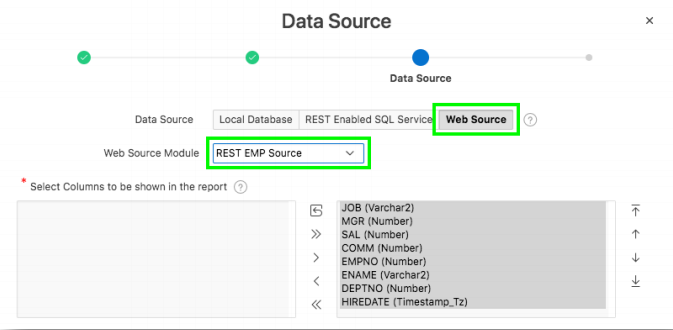
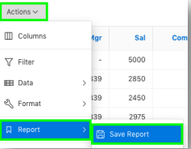
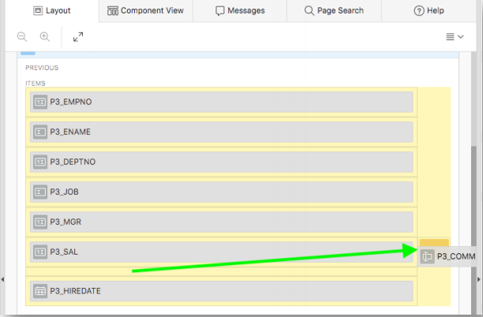
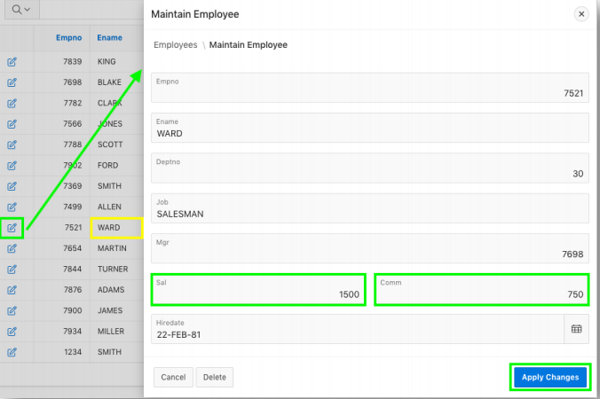

# Module 4:  EMP 리포트와 폼 - 페이지 생성

'Module 4'에서는 애플리케이션에 연결한 웹 소스를 이용하여 새로운 페이지를 만들어 볼 것입니다. 생성한 페이지에 추가 기능을 추가하기 위해서 수정할 것입니다. 

### **Part 1**: Creating a page using Web Source

1. 애플리케이션 홈페이지로 이동합니다. 

2. '**Create Page**' 버튼을 클릭합니다.

    

3. 페이지 타입으로 '**Report**'를 클릭합니다. 
    

4. 리포트 세부 타입으로 '**Report with Form**'을 선택합니다.  
    

5. 다음을 입력하고 '**Next**'를 클릭합니다.

    | 속성 | 입력 및 선택 | 값 |
    | --- |--- |--- |
    | Report Page Name | 입력 | **Employees** |
    | Form Page Name | 입력 | **Maintain Employee** |
    | Form Page Mode | 선택 | **Modal Dialog** |
    | Breadcrumb | 입력 | **Breadcrumb** |
    | Entry Name | 입력 | **Employees** |

    

6. 내비게이션 속성은 '**Create a new navigation menu entry**'를 선택하고 '**Next**' 버튼을 클릭합니다.

    

7. 데이터 소스에 대해서는 '**Web Source**'를 클릭합니다.
8. 'Web Source Module' 항목에서는 '**REST EMP Source**'를 선택하고 **Next** 버튼을 클릭합니다.

    

9. 'Primary Key Column'에 대해서는 '**EMPNO (Number)**'를 선택합니다. 그리고 '**Create**' 버튼을 클릭합니다. 

    

### **Part 2**: 애플리케이션 실행

1. 'Page Designer'에서, '**Save and Run**' 버튼을 클릭합니다.  
    

2. 로그인 페이지에서 사용자 인증 정보를 입력합니다. 사용자 명에 '**``demo_hol``**' 패스워드에 '**``SecretPassw0rd``**'를 입력하고 'Sign In' 버튼을 클릭합니다.
    

3. Employees 페이지를 확인합니다.

    

4. Employees 리포트 페이지에서 '**Actions**'을 클릭하고 다시 **Columns**를 클릭합니다.

    

5. **EMPNO**, **ENAME**, **DEPTNO** 컬럼을 가장 위로 올립니다. 대상 컬럼을 선택하고 화살표를 이용하여 이동시킵니다. 컬럼 이동을 마치고 '**Apply**' 버튼을 클릭합니다.

    

6. '**Actions**'을 클릭하고 '**Report**'를 선택한 후 '**Save Report**'를 클릭합니다.

    

7. 저장을 위해서 '**As Default Report Settings**.를 선택합니다.   
    

8. '**Apply**' 버튼을 클릭합니다.

    

9. 행의 편집 아이콘을 클릭합니다. 'Form Page'가 출력될 것입니다. 

11. 화면 아래의 'Developer Toolbar'에서 '**Edit Page 3**'을 클릭합니다. 
    
     

    - 'Page Designer'는 현재 페이지를 출력합니다. 
    - 주의: 'Developer Toolbar'는 App Builder에서 애플리케이션을 실행할 때만 나타납니다. 따라서 일반 사용자에게는 보이지 않습니다.

### **Part 3**: 페이지 수정

1. 왼편에 위치하는 Rendering 탭에서, **P3_EMPNO** 컬럼을 클릭합니다.

    - 오른쪽에 위치하는 Property Editor에서
        - Type 항목에서 '**Number Field**' 선택.
        - Label 항목에 **EMPNO** 입력.

    

2. 왼편에 위치하는 Rendering 탭에서, **P3_JOB** 컬럼을 선택하고 
    - 오른쪽에 위치하는 Property Editor에서, Type 항목에 대해서 **Text Field**를 선택합니다.

3. 왼편에 위치하는 Rendering 탭에서, **P3_ENAME** 컬럼을 선택하고
    - 오른쪽에 위치하는 Property Editor에서, Type 항목에 대해서 **Text Field**를 선택합니다.

4. 렌러딩 트리에서 **P3_ENAME** 드래그하여 **P3_EMPNO** 아래에 이동시킵니다.

    

5. 왼편에 위치하는 Rendering 텝에서, **P3_DEPTNO**를 선택하고 드래그하여 **P3_ENAME** 아래로 이동시킵니다.

6. 중앙에 위치하는 레이아웃에서, **P3_COMM**을 선택하고, 드래그하여 **P3_SAL** 옆으로 이동 시킵니다.
    

7. 툴바에서 **Save** 버튼을 클릭합니다.

### **Part 4**: 레코드 추가

1. 'Runtime environment'로 다시 이동합니다. 그리고 브라우저를 화면을 갱신합니다. 

2. **Create** 버튼을 클릭하고 다음 데이터를 입력합니다. 

    

    | Property | Enter or Select | Values |
    | --- | --- | --- |
    | Empno | enter | **1234** |
    | Ename | enter | **SMITH** |
    | Deptno | enter | **10** |
    | Jpb | enter | **CLERK** |
    | Mgr | enter | **7839** |
    | Sal | enter | **1500** |
    | Hiredate | select | **임의의 날짜 선택** |
  
    - '**Create**' 버튼을 클릭합니다.
    - Employees 리포트 페이지에서 입력한 데이터를 확인합니다. 

    

### **Part 5**: 입력 데이터 수정

1. 리포트에서 **Ward**를 찾고, 이 데이터의 행에서 'edit icon' 아이콘을 클릭합니다. 그리고 다음과 같이 데이터를 수정합니다. 

    | 속성 | 입력/선택 | 설정값 |
    | --- | --- | --- |
    | Sal | 입력 | **1500** |
    | Comm | 입력 | **750** |

    - '**Apply Changes**' 버튼을 클릭합니다.
    - 리포트에서 **Ward**의 변경 결과를 확인합니다.

    

### **Part 6**: 데이터 삭제

1. 리포트에서 '**Turner**' 데이터를 찾아서 'edit icon'을 클릭합니다.
2. 팝업 윈도에서 '**Delete**' 버튼을 클릭하고 '**Ok**' 버튼을 클릭합니다.
    - 리포트에서 'Turner' 데이터가 삭제된 것을 확인할 수 있습니다.

    

## 요약

"Module 4"를 완성했습니다. 이번 모듈에서는 웹 소스를 이용하여 페이지를 만드는 실습을 진행했습니다. 이번 실습에는 페이지 디자이너를 이용하여 화명을 수정하는 것과 런타임 환경에서 데이터를 수정하는 방법에 대하여 알아봤습니다. [이 링크를 클릭하여 'Module 5'로 넘어가시기 바랍니다.](5-using-the-rest-service-on-dept-defining-list-of-values.md)