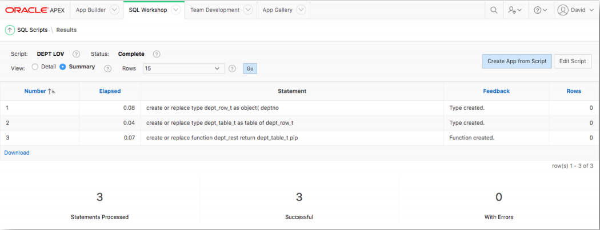
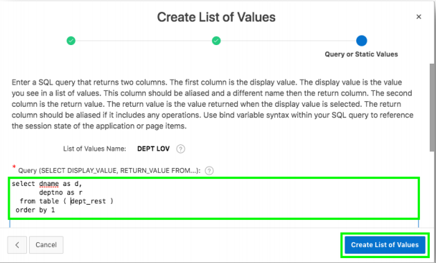

# Module 5: DEPT 테이블의 REST 서비스를 이용하여 값 목록 정의

'Module 5'에서는 DEPT를 위한 웹 소스 모듈을 만들어 볼 것입니다. 그리고 그러면 값 목록을 추가하고 이를 사용하여 Employee 페이지를 개선해 볼 것입니다. 

### 정보

첫 번째 워크스페이스에서 스크립트를 실행해서 DEPT 테이블에 대한 REST 처리기를 생성했습니다. 이제   APEX_EXEC 패키지를 사용하여 PL/SQL 함수에 REST URI를 활용할 수 있다.

APEX_EXEC 패키지를 활용하기 위해서 우선 애플리케이션에 REST DEPT 서비스로 Web Source를 정의해야 합니다.

완전히 구현을 마치면, DEPT 테이블의 값 목록(List of Value)을 기반으로 하는 함수를 사용할 수 있습니다. 

자세한 사항은 다음 블로그를 참조하시기 바랍니다.

- https://blogs.oracle.com/apex/apex-181-early-adopter-2-rest-services-and-plsql

### **Part 1**: DEPT를 웹 소스로 추가

1. 'Application Builder'로 이동합니다.
2. 'App Builder' 홈페이지에서 애플리케이션을 선택합니다. (DEMO_HOL) 
3. '**Shared Components**'를 클릭합니다.
4. 'Data Sources' 아래에 '**Web Source Modules**'을 클릭합니다.
5. 'Web Source Modules'에서 '**Create**' 버튼을 클릭합니다.
6. '**Next**' 버튼을 클릭합니다.
    - Default으로 선택된 From Scratch를 사용합니다.
7. 'Web Source Type'에서 '**ORACLE REST Data Services**'를 선택합니다.
8. 이름 항목에 '**REST DEPT Source**'을 입력합니다.
9. 'URL Endpoint' 항목에 dept.rest 핸들러의 REST URI를 설정합니다. 그리고 '**Next**' 버튼을 클릭합니다. 
    - REST URI는 다음과 같은 형태를 보입니다. 
    - https://<< your service >>/dpeake_rest/**dept**/hol/*

    
     
10. 'Base URL'과 'Service URL Path를 확인하고 '**Next**' 버튼을 클릭합니다.
11. '**Discover**' 버튼을 클릭합니다.
    - *Authentication Required = No*를 유지합니다.

12. '**Create Web Source**' 버튼을 클릭합니다.

    

### **Part 2**: DEPT를 호출하는 함수 추가

1. 메인 메뉴에서 '**SQL Workshop**'을 선택하고 '**SQL Scripts**'를 호출합니다. 

    

2. '**Create**' 버튼을 클릭합니다.  
    

3. 다음 URL을 복사해서 브라우저의 URL 창에 복사해 놓고 이동합니다. 그리고 스크립트 내용을 복사합니다.
  http://www.oracle.com/technetwork/developer-tools/apex/application-express/apex-hol-func-5478627.txt

4. 스크립트 편집기에서 
    - Script Name 항목에 '**DEPT Function**'를 설정합니다.
    - 앞에서 복사한 내용을 본문에 붙여넣습니다.
    - '**Run**' 버튼을 클릭합니다.  
    

    - '**Run Now**' 버튼을 클릭합니다.
    - 결과로 3개 Statement가 성공적으로 완료됨이 표시됩니다. 
    

### **Part 3**: 값 목록(List of Values) 추가

1. 'App Builder'로 돌아옵니다. 그리고 애플리케이션을 선택합니다. 
2. '**Shared Components**'를 선택합니다. 그리고 '**List of Values**'를 클릭합니다.

    

3. '**Create**' 버튼을 클릭하고 '**Next**' 버튼을 클릭합니다..
    - 기본값인 'Default: From Scratch'를 유지합니다.
4. 이름 항목에 '**DEPT LOV**'을 입력합니다.
5. 타입 항목에 '**Dynamic**'을 선택합니다.
6. '**Next**' 버튼을 클릭합니다.

    

7. 'Query' 항목에 다음을 입력합니다.   
    ```
      select dname as d,
             deptno as r
        from table ( dept_rest )
      order by 1
    ```

      
    - 주의: 'dept_rest'는 'Part 2'에서 생성한 함수 이름입니다. 
    - '**Create List of Values**' 버튼을 클릭합니다.

### **Part 4**: EMP 페이지 수정

1. 상단 메뉴 패스(Breadcrumb)에서 **Application xxxxx**을 클릭한 다음 '**2 - Employees**'를 클릭합니다.

    


2. 왼쪽에 위치하는 'Rendering' 트리에서'**Columns**'를 클릭합니다. 그리고 '**DEPTNO**'를 클릭합니다.  
    - 오른쪽에 위치하는 'Property Editor'에서
        - Type 항목에 '**Plain Text (based on List of Values)**'을 선택합니다. 
        - 'List of Values' 항목에 '**DEPT LOV**'을 선택합니다. 
        - 'Heading' 그룹 아래에 'Alignment' 항목에서 '**Start**'을 클릭합니다. 
        - 'Layout' 그룹 아래에 'Column Alignment' 항목에서 '**Start**'을 클릭합니다.
    - 오른쪽 상단의 툴바에서 '**Save**' 버튼을 클릭합니다.

    

3. 페이지 **3**으로 이동합니다.

    

4. 왼쪽에 위치하는 'Rendering' 트리에서 '**P3_DEPTNO**'을 선택하고
    - 오른쪽에 위치하는 'Property Editor'에서
        - Type 항목에 '**Select List**' 선택합니다. 
        - 'List of Values' 그룹의 Type 항목에서 '**Shared Component**'를 클릭합니다.
        - 'List of Values' 항목에 '**DEPT LOV**'를 선택합니다.. 
        - 'Display Extra Values'에 '**No**'를 선택합니다. 
        - 'Display Null Value'에 '**No**'를 클릭합니다.
    - 오른쪽 상단에 위하는 툴바에 '**Save**'를 클릭합니다. 

    

### **Part 5**: 애플리케이션 실행

1. 'Runtime Environment'에 이동하여 브라우저를 갱신합니다. 

    

2. 레코드 중에 하나를 선택하고 'edit icon'을 클릭합니다. 그리고 Department 항목을 선택합니다. 

    

## 요약

"Module 5"를 완성했습니다. 애플리케이션에 Web Source를 생성하는 방법에 대하여 알아보았습니다. 그리고 REST Endpoint를 애플리케이션에 연결해 보았습니다. 

## **추가 자료** - *유용한 링크*

- Autonomous와 APEX  https://apex.oracle.com/autonomous
- APEX 사이트  http://apex.oracle.com
- 튜토리얼  https://apex.oracle.com/en/learn/tutorials
- Community  http://apex.oracle.com/community
- 공개 사이트 + 슬랙  http://apex.world